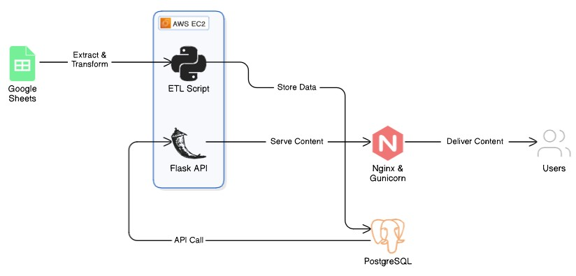
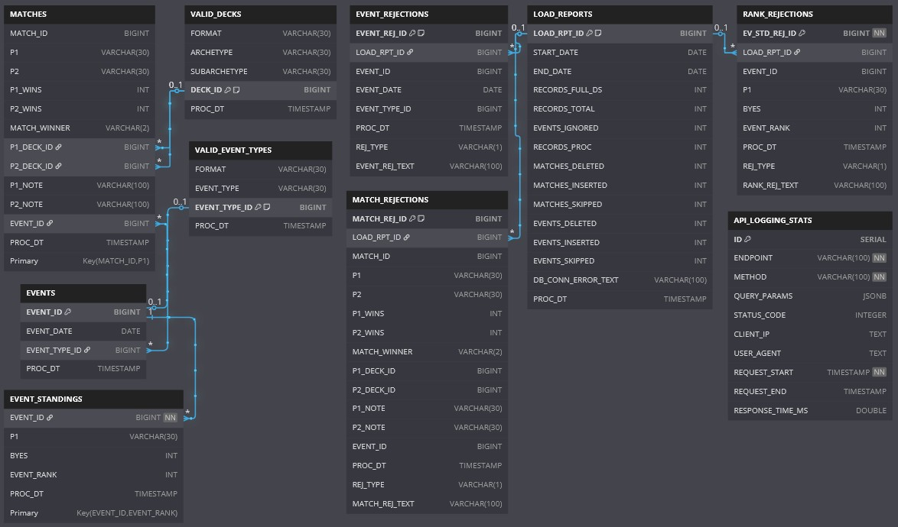
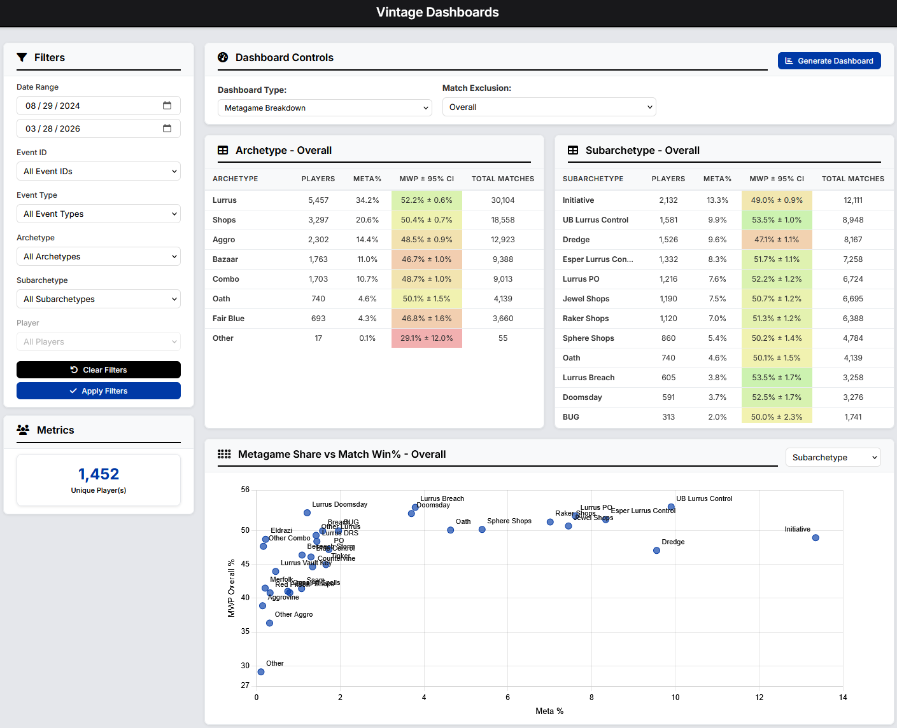


<h1 class="page__title">{{ page.title }}</h1>

 


This project is an ETL (Extract, Transform, Load) pipeline designed to process match results for Vintage tournaments on Magic Online (MTGO). Data is processed, loaded, and made available to users via API and interactive dashboards.

See <strong><a href="https://github.com/cderickson/API.VintageData.IO">GitHub Repository</a></strong>.

 

## Process

- <strong>Extract</strong> data from a publicly maintained Google Sheet.
- <strong>Clean & Transform</strong> tournament results, matchups, and deck information.
- <strong>Load</strong> structured data into a PostgreSQL database.
- <strong>Deploy</strong> a public REST API for querying match results and event information.
- <strong>Present</strong> data to users through dashboards visualizing metagame trends, player leaderboards, and deck matchup statistics.

The ETL code is stored as <b>Python</b> scripts and scheduled to run weekly using <b>cron</b> on an <b>EC2 instance</b>. These scripts pull data from a public Google Sheet, clean and transform it, and then load it into a <b>PostgreSQL</b> database hosted on <b>Amazon RDS</b>.

## Data Source		

<strong><a href="https://docs.google.com/spreadsheets/d/1wxR3iYna86qrdViwHjUPzHuw6bCNeMLb72M25hpUHYk/edit?gid=1611466830#gid=1611466830">MTGO Vintage Metagame Data</a></strong>: Public Google Sheet with community-collated tournament results, matchups, and deck archetypes.

## Architecture

This project is deployed in <strong>AWS</strong> using an <strong>EC2</strong> instance and <strong>AWS RDS</strong> (<strong>PostgreSQL</strong>) database.

    

        
    

    

        <header class="major">
            <h3 style="padding: 0; margin-bottom: 0">Architecture Diagram</h3>
        </header>
    

## Database Schema

The data is loaded and stored in a <b>PostgreSQL</b> database with the following tables:

    <table style="margin: 0 auto;">
        <thead>
            <tr>
                <th style="color: #000;">Table Name</th>
                <th style="color: #000;">Description</th>
            </tr>
        </thead>
        <tbody>
            <tr>
                <td><b>EVENTS</b></td>
                <td>Captures individual tournament events.</td>
            </tr>
            <tr>
                <td><b>EVENT_REJECTIONS</b></td>
                <td>Tracks rejected events and reason text.</td>
            </tr>
            <tr>
                <td><b>MATCHES</b></td>
                <td>Stores match results, player deck IDs, and outcomes.</td>
            </tr>
            <tr>
                <td><b>MATCH_REJECTIONS</b></td>
                <td>Tracks rejected matches and reason text.</td>
            </tr>
            <tr>
                <td><b>EVENT_STANDINGS</b></td>
                <td>Returns the final standings and player ranks of an event.</td>
            </tr>
            <tr>
                <td><b>RANK_REJECTIONS</b></td>
                <td>Tracks rejections event standings records and reason text.</td>
            </tr>
            <tr>
                <td><b>VALID_DECKS</b></td>
                <td>Classification table storing valid deck archetypes.</td>
            </tr>
            <tr>
                <td><b>VALID_EVENT_TYPES</b></td>
                <td>Classification table containing valid event type names.</td>
            </tr>
            <tr>
                <td><b>LOAD_REPORTS</b></td>
                <td>Logs ETL process execution details.</td>
            </tr>
            <tr>
                <td><b>API_LOGGING_STATS</b></td>
                <td>Logs API endpoint usage statistics.</td>
            </tr>
        </tbody>
    </table>

 

See <strong><a href="https://mox-data.com/vintage-data/data-dictionary">Data Dictionary</a></strong> for feature definitions.

    

        
    

    

        <header class="major">
            <h3 style="padding: 0; margin-bottom: 0">Entity-Relationship Diagram (ERD)</h3>
        </header>
    

## API Development

A <strong>REST API</strong> was developed using <strong>Flask</strong> and deployed using an <strong>EC2 instance</strong>, which is configured to serve requests through <strong>Nginx</strong> and <strong>Gunicorn</strong>. The API provides HTTP endpoints for querying processed match results and event data.

See <strong><a href="https://mox-data.com/vintage-data/api-documentation">API Documentation</a></strong> for API Endpoint usage instructions.

## Dashboards

Dashboards were created primarily using chartJS and provide insights into the online Vintage metagame using our processed data. They include:

- <strong>Overall Metagame Trends</strong> – High-level analysis of deck popularity and performance.
- <strong>Event Explorer</strong> – Detailed view of individual tournament results.
- <strong>Player Leaderboard</strong> – Rankings based on player performance across events.
- <strong>Deck Matchup Heatmap</strong> – Visualization of win rates between different deck archetypes.

See the <strong><a href="https://mox-data.com/vintage-data">Vintage Dashboards</a></strong> page on the Mox Data platform.

    

        
    

